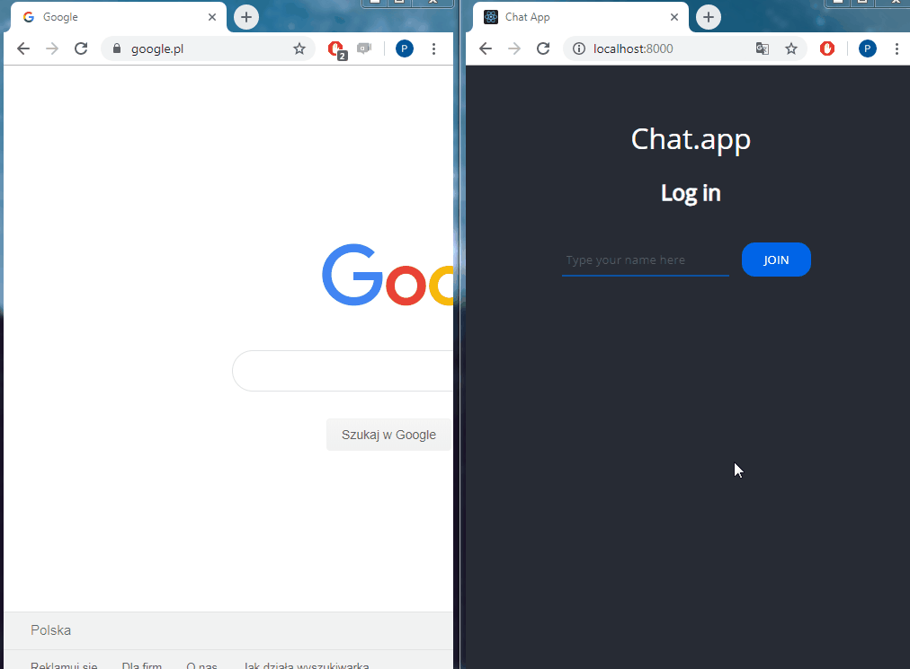

<p align="center">
<a href="https://chat-websocket-app.herokuapp.com/"></a>
</p>


# <p align="center">📩 Chat.app (WebSocket)</p>
<p align="center">Project for WebSocket learning</p>

</br>

## Table of Contents

- [What's this project about?](#about)
- [Technologies used](#technologies)
- [What I learned?](#what)
- [Interesting code snippet](#interesting)
- [Installation and quick start](#install)
- [Website (on Heroku)](#site)

</br>

## <a name="about"></a>What's this project about?

This is a chat application based on WebSocket communication. It enables real-time communication with many participants. Additionally, it informs about joining or leaving the chat by a particular user.

</br>

## <a name="technologies"></a>Technologies used
- HTML
- CSS
- JavaScript
- GIT
- Socket.io (WebSocket)
- Express

</br>

## <a name="what"></a>What I learned?

- differences between AJAX and WebSocket,
  - AJAX:
    - no permanent/continuous communication,
    - communication with the server in the request–response system,
    - only one party initiating contact (customer),
  - WebSocket:
    - continuous communication from beginning to end,
    - server-client communication takes place by emitting and receiving events,
    - communication initiated by both parties,
    - real-time communication,
- when is best to use WebSocket and AJAX,
- WebSocket connection stages,
- use the socket.io package to simplify using WebSocket,
- set up the server as an intermediary between WebSocket clients,
- send events to individual clients or to all but the sender,


</br>

## <a name="interesting"></a>Interesting code snippet (for me of course 😉)
- server-side socket setup:

```js
const socket = require('socket.io');

...
...

const server = app.listen(port, () => console.log(`Example app listening at http://localhost:${port}`));

const io = socket(server);

io.on('connection', (socket) => {
  socket.on('message', (message) => {
    messages.push(message);
    socket.broadcast.emit('message', message);
  });

  socket.on('login', (user) => {
    users.push({ name: user, id: socket.id });
    socket.broadcast.emit('message', { author: 'Chat Bot', content: `${user} has joined the conversation!` });
  });

  socket.on('disconnect', () => {
    const user = users.find(user => user.id === socket.id);
    socket.broadcast.emit('message', { author: 'Chat Bot', content: `${user.name} has left the conversation... :(` });
    users.splice(users.indexOf(user), 1);
  });
});
```


</br>

## <a name="install"></a>Installation

- use the package manager [npm](https://www.npmjs.com/get-npm) or [yarn](https://classic.yarnpkg.com/en/) to install dependencies:

```bash
npm install // yarn install

or

npm i // yarn
```
- run server with nodemon (after nodemon installation):

```bash
npm start

or

yarn start
```

<br/>


## <a name="site"></a>Website (on Heroku)
[Chat.app](https://chat-websocket-app.herokuapp.com/)
- if the page loads slowly, wait a moment, the server is waking up because it is hosted on a free platform Heroku.

</br>
</br>

  *project implemented as part of the 9-month [Web Developer Plus](https://kodilla.com/pl/bootcamp/webdeveloper/?type=wdp&editionId=309) course organized by [Kodilla](https://drive.google.com/file/d/1AZGDMtjhsHbrtXhRSIlRKKc3RCxQk6YY/view?usp=sharing)


